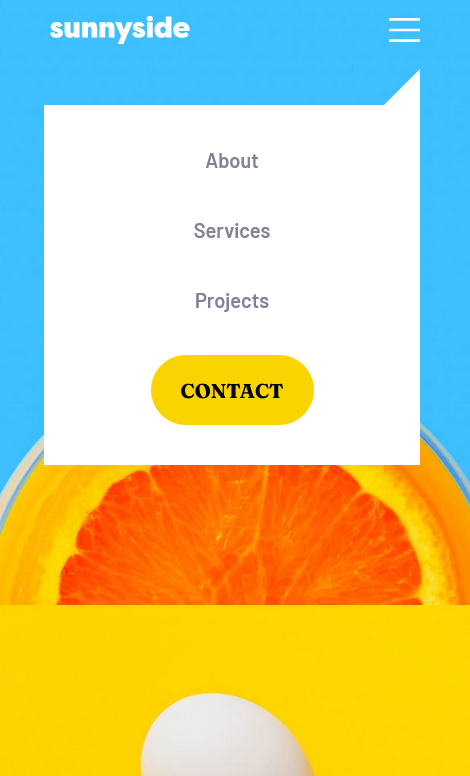

# Sunnyside agency landing page

This is a solution to the [Sunnyside agency landing page](https://www.frontendmentor.io/challenges/sunnyside-agency-landing-page-7yVs3B6ef)

## Table of contents

- [Overview](#overview)
  - [The challenge](#the-challenge)
  - [Screenshot](#screenshot)
- [My process](#my-process)
  - [Built with](#built-with)
  - [Useful resources](#useful-resources)
- [Author](#author)

## Overview

### The challenge

Users should be able to:

- View the optimal layout for the site depending on their device's screen size
- See hover states for all interactive elements on the page

### Screenshot
- Mobile:  

- Desktop:

- Active-states:

- Menu:  

### Built with

- Semantic HTML5 markup
- CSS custom properties
- Flexbox
- CSS Grid
- Mobile-first workflow
- Javascript
- Bootstrap

### Useful resources

- [Bootstrap](https://getbootstrap.com/) - Build fast, responsive sites with Bootstrap

## Author

- Website - [Github](https://github.com/amrmabdelazeem)
- Frontend Mentor - [@amrmabdelazeem](https://www.frontendmentor.io/profile/amrmabdelazeem)

